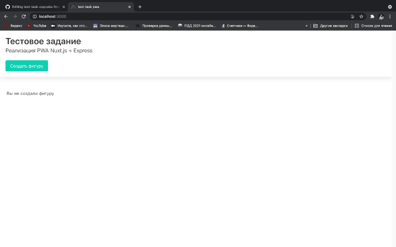

## Тестовое задание

## Задание

Необходимо реализовать простейшее CRUD web-приложение. Для этого необходимо использовать Front - nuxt.js (pwa) Back - node.js (express) Db - mongodb.



### Дополнительное требование 

Возможность развернуть приложение в Docker

Запуск Dockerа реализуйте командой:

```bash
$ docker-compose up
```
